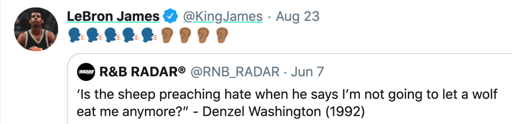

# Colores

Yup muestra el valor social a través de colores que subrayan el contenido calificado y los usuarios en la extensión y la aplicación web. Cada color representa un valor porcentual en relación con todo lo demás en su categoría.

### Esquema de colores

Actualmente hay cinco colores:

1. Verde: El 20%  superior
2. Verde amarillento: 20 - 40% 
3. Amarillo 40 - 60% 
4. Naranja 60 - 80% 
5. Rojo: 80 - 100%

**Por ejemplo, el color del "tuit" más valorado socialmente sería el verde o el azul.**

**...Y el menos valioso sería el rojo.**

El contenido se vuelve más verde cuando se califica positivamente y más rojo cuando se califica negativamente, lo que refleja un aumento o disminución del valor social del contenido.

**Avanzado**

Cada contenido puede tener un color diferente para cada categoría. Dentro de cada categoría, ese contenido se está relacionando con otros contenidos dentro de esa categoría.

### Conclusión

Esperamos que, con el tiempo, cada contenido sea subrayado con el color que represente fielmente su valor social según las opiniones de la comunidad online. Ver [Categorias](https://docs.yup.io/v/espanol/basic/categorias)

