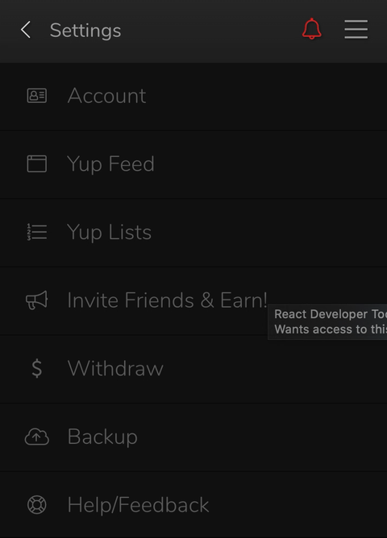

# Backing up your account

It's important to back up your account because it is the safest way to take control over your account and ensure that you don't lose it.

##  1. Open the extension popup and click "Settings" and then "Backup".

&lt;/div&gt;

##  2. Open the extension popup and click "Settings" and then "Backup".

##  3. Enter your password.

##  4. Save the backup file somewhere safe!

