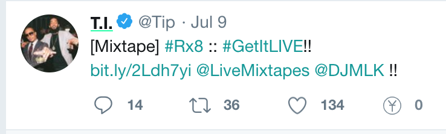

# Colors

Yup displays social value via colors that underline certain data, both for the extension and the web application. They each represent a percentile of value in relation to everything else in their category.

## Color Scheme

There are currently six colors:

1. <l style="text-decoration:underline;text-decoration-color:#00E4FF;">Blue</l>: top 15%
2. <l style="text-decoration:underline;text-decoration-color:#00FFA6;">Green</l>: 15 - 33%
3. <l style="text-decoration:underline;text-decoration-color:#3EFF00;">Yellowish Green</l>: 33 - 50%
4. <l style="text-decoration:underline;text-decoration-color:#FFFB00;">Yellow</l>: 50 - 67%
5. <l style="text-decoration:underline;text-decoration-color:#FFAE00;">Orange</l>: 67 - 85%
6. <l style="text-decoration:underline;text-decoration-color:#FF6100;">Salmon</l>: bottom 15%

<b>For example, the color of the most socially valued 'tweet' would be green or blue.</b>

</img>

<b>...And the least valuable would be orange.</b>

</img>

You can help improve content's color by upvoting it, or bring it down a peg by downvoting it.

<i><b>Advanced</b></i>

Each piece of content can have a different color for EACH category. Within each category, that content is being related to other content within that category. 

## Conclusion

- We hope that, over time, the social value color of each piece of content will be reflective of their actual social value in the public and in various categories. <i>See [Categories](/categories.md)</i>

