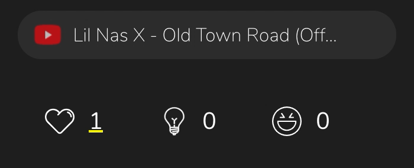
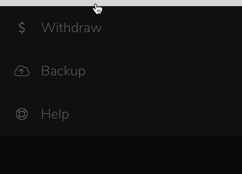

# Yup Extension
[Download Extension](https://chrome.google.com/webstore/detail/yup/nhmeoaahigiljjdkoagafdccikgojjoi)

Yup is a network that rewards you for good opinions. Its goal is to create a social consensus layer on the internet, accurately representing the agreed-upon social value of anything, from random Tweets to your history professor. Yup then rewards its users proportional to the social value of their contributions. With the Yup extension, you can earn rewards as you normally browse the internet. All you have to do is vote through the extension, or directly on Twitter, Reddit, YouTube, or Google Maps. The technology is complicated, but how it works is simple.

1. The Extension is a browser plug-in that rewards users' opinions across the web.

  

    
    </img>
    
Extension Popup

  

The Yup Web Extension is a web browser plug-in that gives users the ability to express their opinion on any site on the internet. You can express your opinion by voting with several categories: upvote/downvote in the 'like', 'smart', or 'funny' categories. When other users give the same opinion on the same content, you get paid!

2. On certain sites, information and Yup functions are overlaid for better use.

  

    
    </img>
    
Twitter overlay

  

    

      
      </img>
      
Google Maps

  

The extension functions as both a tool for Yup-related actions and a general EOS wallet, utilizing Scatter API. You can use it by clicking on the extension itself or by using the overlaid button on the overlaid sites. For the overlaid sites, you can also simply use traditional reactions (like, upvote, ratings) and they'll be treated as Yup votes too!

3. You can redeem your YUPX as rewards with Amazon, Venmo, and PayPal credits.

  

    
    </img>
    
Redeem to Amazon

  

Besides redeeming monetary rewards, you can send your YUPX to friends and other accounts. But don't spend them all! They help build Influence, which earns you more rewards in the future.

**Requirements:** *Chrome*, *Opera*, *Brave*, or *Firefox* browsers.

**Works with:** Any site on the internet!

**Overlays on:** (currently)

1. Twitter
2. Reddit
3. Google Maps
4. YouTube (reactions only)
   

