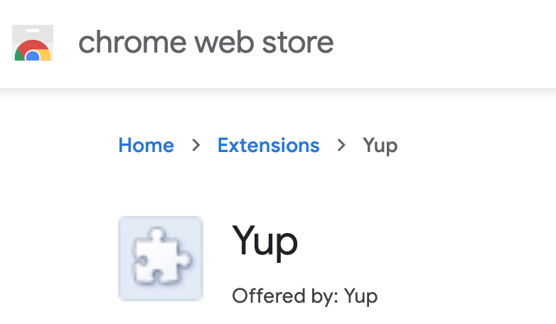

# Yup Extension Setup

## Downloading

There are two ways to download the extension:

1. Chrome Store
2. Yup Website

</img>

## Invite Code

Currently, you need an invite code to use the Yup app and extension. You should receive one from the Yup team or from an existing user. If you don't have one, apply Here or through the extension.

## Username and Password

You need to pick a username and password for your account.

## Security Considerations

You should download and save your backup key, in case you lose access to your account for some reason.

