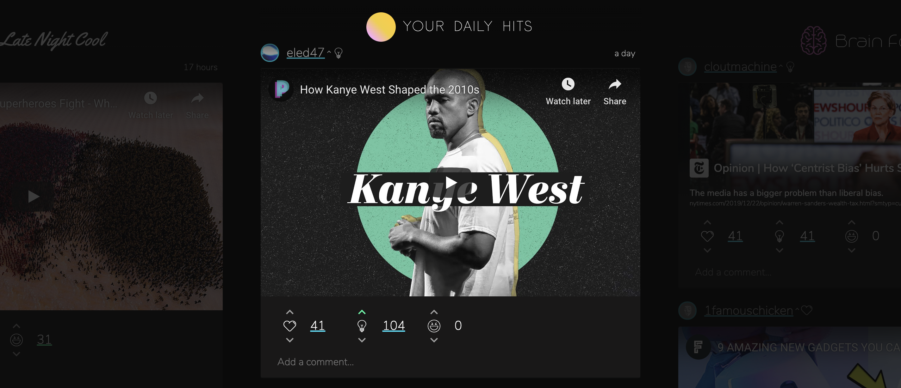

# App

## Feed

The Feed is a culmination of the Internet’s best content, curated by mood or topic. It includes embedded media such as tweets, YouTube videos, SoundCloud songs, Subreddits, and much more. Currently, there are 5 curated feeds. Users can customize their feeds based on accounts, circles, or topics.

**Profile**

From the feed, you can check out your profile and the profiles of other users. You can edit your image, full name, and bio by clicking "EDIT PROFILE".

## Lists

Lists aggregate Yupsters' opinions into rankings to help you find the best of Yup. Find the smartest people on Twitter, the funniest Reddit posts, the most knowledgeable professors, and more through our lists. Lists are totally public––you don’t need a Yup account to use it! Filter by site, subject, and category to find what you’re looking for.

 (1) (1).gif>)

**Advanced**\
Lists are **weighed** by each category separately and distinctly. That means that the usage and influence being spent in a category determines its relevance on lists.
