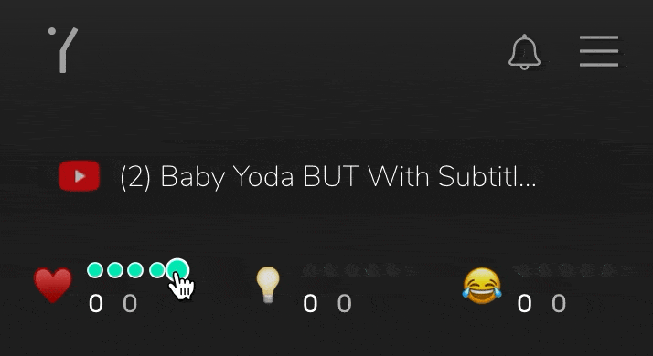

# Extension

## Yup Extension

[Extension](https://chrome.google.com/webstore/detail/yup/nhmeoaahigiljjdkoagafdccikgojjoi)

With the Yup extension, you can earn rewards as you regularly browse the internet. All you have to do is rate through the extension, or directly on Twitter, Reddit, YouTube, or Google Maps.

The Yup Extension gives you the ability to express your opinion on any site on the Internet, on a scale of 1-5 in categories such as ‘popular’, ‘smart’, and ‘funny’. When other users give the same opinion on the same content, you earn YUP tokens and influence!

Learn more: [YUP](../../protocol/yup-protocol.md#yup-token) | [Influence](../../protocol/yup-protocol.md#influence) | [Categories](../../basic/categories.md) | [Rewards](../../basic/rewards.md)

On certain sites, information and Yup functions are overlaid for better use.

   &#x20;

The extension functions as both a tool for Yup-related actions and a crypto account. You can use it by clicking on the extension itself or by using overlaid buttons on certain sites. Additionally, you can use traditional reactions (i.e. Twitter likes, Reddit upvotes, Gmaps ratings) and they’ll be treated as a Yup rating too!

Learn more: [Rating](../../basic/rating.md) 

YUP tokens can be sent to other accounts. But don't send them all! They help build Influence, which can earn you more rewards in the future.

Learn more: [Influence](../../protocol/yup-protocol.md#influence) | [Rewards](../../basic/rewards.md)

**Requirements:** _Chrome_, _Opera_, _Brave_, or _Firefox_ browsers.

**Works with:** Any site on the Internet!
