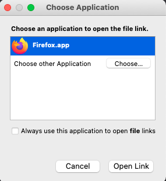

# Firefox Add-On

## 🦊  [Download Firefox Add-On](https://github.com/Yup-io/yup\_docs/raw/master/yup.xpi)

### Quick Guide:&#x20;

1. [Download Yup Firefox Add-On](https://github.com/Yup-io/yup\_docs/raw/master/yup.xpi) from link above
2. Choose to open file in Firefox
3. Accept permissions

.png>)

.png>)
