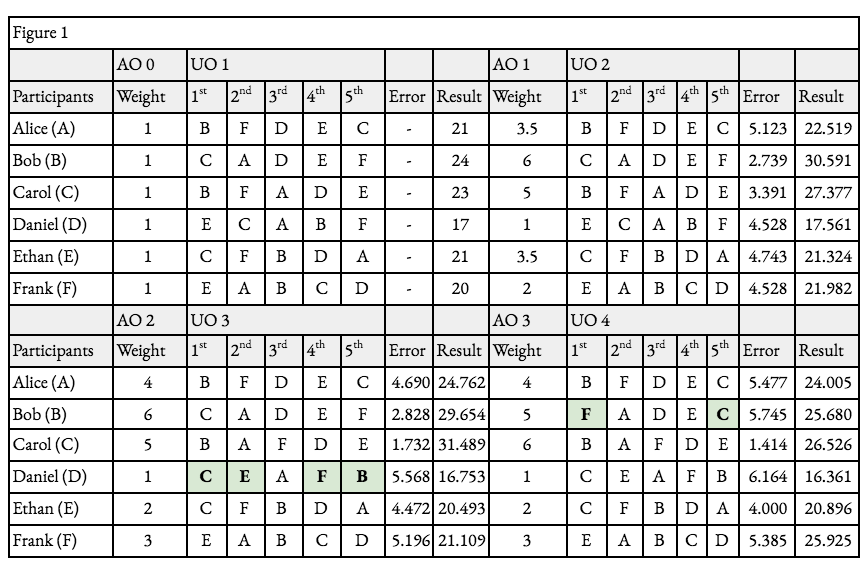

# Yup Protocol

## Protocol

The Yup Protocol is a social consensus protocol for the Internet. It is infrastructure for a new type of social network, which identifies content and distributes rewards according to its value. Users build influence and receive token rewards by rating, posting, and curating content. Their ratings, influence, and rewards are proportional to their value as determined by other users. Assets earned through staking, engagement, and approval determine the impact of their ratings.&#x20;

The social level mechanism facilitates hierarchical governance of the protocol, solving significant digital identity issues, enabling accurate and transparent representation of social value, and ownership and equitable monetization of personal data. Fractionalized shares of accounts and communities governed online will encourage community-building, entertainment, and advocacy. The network exists within the framework of the protocol.

We define content as anything which generates opinions, including but not limited to texts, images, videos, locations, accounts, and links. The influence score is a function of engagement, ownership over time, and reputation (see [influence](https://docs.yup.io/products/glossary-+-citations#glossary)). The decision-making and scaling of Yup is determined by the community it serves.

The Yup Protocol provides:

1. _Transparency_ of accounts and filtering tools based on their influence;
2. _Fair and direct monetization_ of opinion, influence, and content through free participation;
3. _Digital identities_ with social capital at stake;
4. _Community-driven_ codes of conduct;
5. _Network governance_ determined by direct influence;
6. _Equitable distribution_ of revenue;
7. _Trustless ownership_ of network footprint;

The extent of these benefits mostly depends on the amount of participation.

### YUP Token

The YUP token is a fungible crypto asset used to incentivize the Yup Protocol. New tokens are minted following a predetermined schedule and distributed according to the influence algorithm and LP shares. The account asset exchange allows top accounts to distribute and sell portions of their account in non-fungible tokens.

#### Supply and Distribution

9,315,081 YUP is minted at genesis and will become accessible over the course of 1 year. The initial one year allocation is as follows:

* 50% to Yup Creators and Curators = 4,657,540 YUP
* 23% to Liquidity Providers = 2,142,469 YUP
* 22% to Team = 2,049,317 YUP
* 5% to Treasury = 465,754 YUP

**Emissions will occur in 4 phases:**

**Phase 0 • Day 1:** YUPX holders will immediately receive a retroactive distribution of YUP at a 1:1 rate. Additionally, over 10k twitter users will receive a proactive distribution of YUP according to their Twitter actions over the last few months and Yup users' ratings of them. Lastly, \~20% of this will be held for unclaimed creator rewards and 15% will be held by team. _This will create an initial supply of 100,000 YUP._

**Phase 1 • 1 Year:** Daily emissions of 1.25% the total supply of YUP

Day 1: 1,250

Day 2: 1,266

Day 3: 1,281

etc...

**Phase 2 • 1,049 Days (2.88 Years):** Daily emissions decrease by 100 YUP each day until 10,000 YUP/day.

**Phase 3 • indefinitely:** Daily emissions of 10,000 YUP

### Reward Mechanism

The components that make up social capital and influence on the network are mostly baked into the reward mechanism of the protocol, except for social level (see {\it Social Level\\/}). In the \gls{Yup protocol}, a large fraction of newly minted tokens are distributed proportionately to content that produces valuable action. We call this fraction the creation allocation Y\textsubscript{c} . We define action value V\textsubscript{h} as the token value of an action. We define creation reward R as the token value (Y) of an individual creation (content of any form, identified numerically). Therefore, the creation allocation of a certain period t is equal to the sum of all of the corresponding creation rewards, and each creation reward equates to the sum of its action value, where j is an ordered set of those actions,

$$
Y_{c,t}  = \sum_{i=1}^{n} R_{i} \quad i.e.\  \quad \exists n \quad R \quad \forall t
$$

$$
R_i =\sum_{j=1}^{m} V_{j} \quad i.e.\  \quad \exists m \quad \forall R
$$

$$
Y{c,t} = \sum{i=1}^{n} \sum{j=1}^{m} V{ij}
$$

Note that each action has a different action value V. This value is determined by the influence of its actions as a fraction of the total influence of all actions on the network within a given period t. We define I\textsubscript{i} as an individual’s influence upon action and $$I_{\overline{i}}$$ as the total influence pool of actions within each minting time interval. Action value is calculated as,

$$
V_{h} = \frac{I_i} {I_{\overline{i},t}} Y_{c, t}
$$

### Influence

Influence is the metric used for weighing token reward distribution, network governance, transparent representation of social value and network commitment rather than token staking. It’s supposed to reflect a user’s social value more accurately than 1-for-1 votes or simple token-weighted schemes. In order to evaluate the influence of each user’s interaction, along with their reward and voting power in the system, the Yup protocol determines each address’s influence under a strict influence function, defined as,

$$
I=\beta_1 \sqrt{A} +\beta_2 \sqrt{a}  +\beta_3 \sqrt{s}  +b
$$

#### Coin Age

For robust consensus, tokens held by an account are reflected by age A in a manner that is distinct from staking. In conventional proof-of-stake mechanisms, there needs to be a clear delineation between staked and unstaked tokens. An important differentiator is the withdrawal delay, or the predetermined period of time in which a miner’s token deposit is locked after they send a “withdraw message” and begin to unstake. This is vital for determining what the Ethereum Foundation refers to as a “dynasty”, or set of miners and their staked tokens for a given time. @casper Additionally, this constructs staking as a time commitment along with a capital commitment. For a protocol like Yup in which the history of investment in the network is noteworthy, it is beneficial to directly reflect the time tokens have been held. We describe a novel use of the concept of coin age as was originated in Peercoin @peercoin, the first proof-of-stake implementation, whereby a token is required to have an age of at least 30 days (30 days of blocks must be confirmed since the input transaction’s block) in order to be used in consensus. While this does create a strong barrier for tokens to be used for consensus, it doesn’t properly represent a stakeholder’s commitment to the network; one account holding 10 tokens for 30 days and another holding 10 tokens for 3 years have the same likelihood of mining a Peercoin block and therefore the same influence over consensus. The Yup protocol takes coin age one step further and attribute direct value to it within consensus. To achieve this, we define Age A as the sum of the token value of each input transaction (k1, k2 , … kn ) multiplied by the number of blocks or periods since each transaction occurred. It is expressed as,&#x20;

$$
A  = \sum_{i=1}^{n} Y_i t_i
$$

This provides several advantages. First, it properly reflects a user’s commitment to the network, accounting for the time they have held their tokens. This prevents newcomers or malicious actors from significantly increasing their influence by purchasing tokens for a short period. Second, because the Yup protocol runs on an existing distributed ledger, the ordering of transactions and clearly defined dynasties are not necessary, allowing the protocol to completely substitute the staking and withdrawal process with this age function without reducing security or stability. Third, it structures time as another scarce asset that is at stake for participants which could be slashed for byzantine behavior, similar to how slashing tokens occurs in PoS. @vitalik For example, a user who acts maliciously may have a certain percentage of their token time slashed temporarily or permanently, reducing their age and ultimately their influence (see _Governance_ section for more information).

#### Activity

In addition to age, network contribution is an important metric for valuing social capital but is difficult to properly measure. We use YUP token rewards as a transparent way to determine this. We decouple earned tokens from purchased tokens by measuring them distinctively and ascribing them a separate value. This includes rewards received for both creation and curation. We define Ru,i as the rewards received from newly minted YUP tokens for each action _i_ done by a specific user/account _u_. We define activity _a_ as a representation of the network value of contributions of an account by measuring the rewards it has received from previous engagement. Mathematically, this is the sum of all previous rewards received by an account, defined as,

$$
a  = \sum_{i=1}^{n} R_u,i
$$

Note that an account’s token balance or age do not affect activity; should a user spend or transfer their earned tokens, their account’s activity remains unchanged. This provides capital-poor participants with more equitable returns reflective of their total contributions to the network irrespective of their current holdings.

Rewards received from previous engagements are critical to an account’s activity metric, but their marginal influence on activity diminishes as it increases. With this, the protocol can properly score an activity’s value, along with how much each creation is worth as a whole.

In order to deter excessive and futile activity while retaining a sense of scarcity, Yup imposes a quota of 10 actions a day (this can be changed through token governance, see _Governance_. An account may continue to interact with the protocol after they reach their action quota, spending their own network resources on futile transactions, but this engagement will have little to no influence and consequently no reward, which means no increase in activity. One reason to still engage in futile behavior is to increase exposure and subsequently social level _s_. Another may be for entertainment purposes. Nonetheless, the strength function provides activity a with an additional scarcity component, reducing the incentives for automated engagement. The distribution of rewards is a complex topic within and outside of the creation. Let us discuss the rewards divvied to each participant of a creation.

#### Creator and Curator Rewards

Similar to how the influence function determines the value of an individual vote, it also determines the allocation of the rewards associated with each vote. Each participant’s allocated reward is dependent on their form of participation, influence during participation, and relative order of participation. From our previous definition (See _Reward Mechanism_), we can determine the current content reward _R_ as the total token rewards awarded to a particular content until the current block, identified numerically. We define the creator reward Rc as the portion of the content reward allocated to the creator of the content. Under any circumstance, the creator of content will receive at least 50% of the content reward: Rc ≥ $\frac{R}{2}$. The remaining half of the reward is distributed among both the creator and all curators based on influence. We define Ic as the creator’s influence during the timestamp of the creation and Ii as the total sum of the influence of all participants for a specific creation. The creator’s portion of this half is determined by the ratio of their influence to the influence of the pool. Totally Rcr is mathematically defined as,&#x20;

$$
R_{c} = R_{i} (\frac{1 + \frac{I_{c}} {I_{pool, t}}} {2})
$$

_For example, let us imagine a regular creation that receives rewards totaling to Ұ100. With an influence Icr worth 20% of the total influence in the pool Ipool, their creator reward would be 1+0.22= 60% \* Ұ100 = Ұ60. This must mean that the other Ұ40 of rewards are given to curators._

Each curator receives rewards for votes that come after their vote, but not before. To measure this ripple effect in rewards and what to allocate to each curator, we use a formula similar to the creator reward scheme but with the separation of value from individual actions _Vj_ in accordance with the curators who participated earlier. We define curator reward Rq as the rewards distributed to a single curator, Vq as the action value designated to that curator’s action, and Vh,j as the action value of the subset of all previous actions. This is mathematically expressed as,

$$
R_{q} = (\frac{1 - \frac{I_{c}} {I_{pool, t}}} {2}) \sum_{i=1}^{n} (\frac{V_q} {V_{h,j}}) V_{j}
$$

_Returning to our previous example above, the 40% allocated to curators is divided among them. Let us say that Alice’s Vcu is Ұ25 and she was the second-to-last curator, Bob’s Vcu is Ұ50 and he was the last curator, and the total sum of Vh so far is Ұ100. Since Alice would only receive a portion of the actions posted after her, she stands to be awarded solely for Bob’s action. Her Rcu is the portion of rewards distributed to users (40%) \* the sum of the value of all following actions (VBob = Ұ50) \* the fraction of Alice’s V over all V prior to Bob’s action (25/50 = 0.5) 0.4_50_0.5 = Ұ10. Alice would receive a 10 YUP reward from Bob’s action. With Bob’s action, the influence pool has increased and the creator’s percentage of it has reduced: 20% → 10%. If Carol now submits an action worth Ұ100 to this creation, the creator would receive roughly Ұ55, Alice would receive roughly Ұ7.5, Bob would receive roughly Ұ30, and the previous curators would receive roughly Ұ7.5._

This reward distribution scheme ensures that curators only receive token rewards from actions that occur after their own and that they receive an allocation of each action’s reward proportionate to their action value among solely previous actions. Economically, this also incentivizes curators to curate quality content early and with a high action value in order to receive rewards from all expected actions to follow.

#### Boost (Burning Mechanism)

In order to maintain the supply of Yup tokens in distribution and increase demand for them, the protocol allows for accounts to burn tokens permanently for a ‘boost’ in influence for a specific action. Users can burn a limited amount of tokens to increase the influence of their action. This can be identified as the number of tokens burned along with a boost multiplier (ς). Boost is mathematically defined as,

$$
b = ςYburn, u
$$

### Social Level Consensus

Yup utilizes layered social level consensus to build sustainable governance of its network and provide proper representation of network value. This orders participants by their recognized social level. Every address on the network will have a social level. Their individual social level _s̄_ will be determined by all other addresses on the network. Each address has its own order of all other addresses that it can manipulate to its desired order. The weight (w) of a user’s order (UO) will be determined by what their level was in the aggregated order (AO) of the previous block, as well as some other minor adjustments. Social level is mathematically defined as,

$$$
\bar s = \sum_{i=1}\frac{s_i * (log(w_i)+ 1)} {\sqrt[5]{e_p}}$$ e = ∑i = 1(ri − μi)2
$$$

Whereby the placement is subject to decrease based on the error (e) of their list in relation to the aggregated one. The error is determined by the sum of the squared differences of each listing, r, to the average level of that account, _μ_. This incentivizes participants to order truthfully, as a vastly incorrect order significantly reduces their own social level. The social level of an address, which determines its weight in future blocks, is the sum of all of the points it has received.

* Example: Alice, Bob, Carol, Daniel, Ethan, and Frank are the existing participants of a network with the same protocol as the one laid out in this proposal. The six users list one another in the ‘genesis block’ of the platform they are using (in order from highest to lowest). Their votes in rounds 1, 2, 3, and 4 are shown in Figure 1. While their weight on the network was uniform for the first round of voting, by round 2, the new social levels and weights of their accounts are (A, 3.5), (B, 6), (C, 5), (D, 1), (E, 2), and (F, 3.5), making Bob the most influential user and Daniel the least influential one. In round 3, Daniel attempts to increase Carol’s influence over Bob by listing her highest and him lowest. While this significantly adds to Daniel’s error (4.528 → 5.568), he successfully pushes Carol to the top of the list. In an attempt to return to the top, Bob lists Carol very low in round 4. While this does strongly reduce the gap in level between he and Carol as well as Carol to everyone else, it dramatically increases Bob’s error (2.828 → 5.745) which decreases his final score and prevents the supposition of Carol.

As shown in _Figure 2_ , aggregated orders are derived from information stored in the previous block. Users can transact with the blockchain to alter their order of relevant addresses. Unless new transactions change users’ orders, they retain their state from the previous block, appearing relatively identical. However, even if an address makes no modifications, their social level and weight are subject to change based on shifts in the aggregated order, which can occur from just one transaction. There may be multiple categories such as likeness, intelligence, trustworthiness, realness, etc.

#### Advantages

There are several uses for a stable and dynamic social level system within an online network of communication and identification. It can provide users with detailed transparency about other accounts, groups, and channels. It can create incentivized barriers to entry and filters for participation within a feed or a chat group. It can identify and prevent artificial or malicious actors and content from receiving any unnecessary attention. It can function as a foundation for governance and decision-making within communities of various sizes that is incentivized by social capital rather than direct monetary gain. It can form digital identities around accounts that can be trusted without a third-party intermediary. The user experience of the social level will be integrated into other interactions on the application, such as votes, comments, and views.
