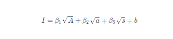
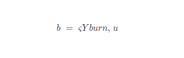
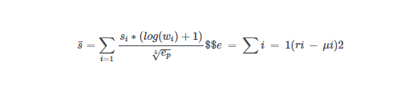

# Yup Protocolo

Protocolo

El Protocolo Yup es un protocolo de consenso social incentivado por una economía de la opinión que se asienta sobre Internet. Establece la infraestructura para una nueva forma de red social. Los usuarios reciben recompensas simbólicas y construyen su influencia en la plataforma calificando, publicando y curando contenidos. El impacto de sus valoraciones y la influencia y recompensas que reciben son proporcionales a su valor, determinado por otros usuarios. El impacto de sus valoraciones viene determinado por el valor de las apuestas, el compromiso y la aprobación. El mecanismo de nivel social construye la gobernanza jerárquica del protocolo, resolviendo importantes problemas de identidad digital, la representación precisa/transparente de los medios de comunicación y la monetización/propiedad equitativa de la información personal. Las cuotas fraccionadas de las cuentas y las comunidades gobernadas en línea fomentarán mercados justos de creación de comunidades, entretenimiento y promoción. La plataforma existe en el marco del protocolo.

Yup es un protocolo de consenso social que facilita la medición, captación e intercambio de capital social en una economía anónima pero transparente basada en la opinión. Identifica los contenidos y distribuye recompensas en función del valor \(influencia\) de las opiniones asociadas a esos contenidos. En este caso, definimos el contenido como cualquier dato específico en línea que el usuario o los usuarios consideren digno de ser juzgado, incluidos, entre otros, textos, imágenes, vídeos, ubicaciones, cuentas y enlaces. La métrica de la influencia es una función de la participación, la propiedad a lo largo del tiempo y la reputación \(ver influencia\). La toma de decisiones y el escalamiento de esta plataforma serán determinados por la comunidad a la que sirve.

El protocolo Yup establece:

1. Transparencia de las cuentas y herramientas de filtrado en función de su influencia;
2. Monetización justa y directa de la opinión, la influencia y los contenidos a través de la participación libre;
3. Identidades digitales con capital social en juego;
4. Códigos de conducta impulsados por la comunidad;
5. El gobierno de la red está determinado por la influencia directa;
6. Distribución equitativa de los ingresos publicitarios;
7. Verdadera propiedad de la huella de la red;

El alcance de estos beneficios depende sobre todo del tamaño de los participantes de la red en este protocolo. En la siguiente sección, explicaremos los componentes que conforman el protocolo Yup y cómo producen los beneficios señalados en esta sección.

### YUP Token

El token YUP está diseñado para ser un criptoactivo fungible utilizado para aumentar el impacto y comprometerse con el protocolo Yup. Los nuevos tokens se acuñan según un calendario predeterminado. El mecanismo de recompensa de tokens acuña nuevos tokens YUP y los distribuye según el algoritmo de influencia y las acciones del LP. El intercambio de activos de la cuenta permite a las cuentas principales distribuir y vender partes de su cuenta en tokens no fungibles.

Suministro y distribución

9.315.081 YUP se acuñan en la génesis y serán accesibles en el transcurso de 1 año. La asignación inicial de un año es la siguiente:

* 50% a los creadores y conservadores de Yup = 4.657.540 YUP
* 23% a Proveedores de Liquidez = 2.142.469 YUP
* 22% para el equipo = 2.049.317 YUP
* 5% al Tesoro = 465.754 YUP

Las emisiones se producirán en 4 fases:

Fase 0 - Día 1: Los titulares de YUPX recibirán inmediatamente una distribución retroactiva de YUP a razón de 1:1. Además, más de 10.000 usuarios de Twitter recibirán una distribución proactiva de YUP en función de sus acciones en Twitter durante los últimos meses y de las valoraciones de los usuarios de Yup sobre ellos. Por último, un 20% de esta cantidad se destinará a las recompensas de los creadores que no hayan sido reclamadas y un 15% será retenido por el equipo. Esto creará un suministro inicial de 100.000 YUP.

Fase 1 - 1 año: Emisiones diarias del 1,25% de la oferta total de PUJ

Día 1: 1.250

Día 2: 1.266

Día 3: 1.281

etc...

Fase 2 - 1.049 días \(2,88 años\): Las emisiones diarias disminuyen en 100 YUP cada día hasta 10.000 YUP/día.

Fase 3 - indefinidamente: Emisiones diarias de 10.000 YUP

Mecanismo de recompensa

Los componentes que conforman el capital social y la influencia en la red están, en su mayor parte, incorporados al mecanismo de recompensa del protocolo, excepto el nivel social \(véase el nivel social\). En el protocolo \gls{Yup}, una gran fracción de los tokens recién acuñados se distribuye proporcionalmente al contenido que produce una acción valiosa. Llamamos a esta fracción la asignación de creación Y\textsubscript{c} . Definimos el valor de la acción V\textsubscript{h} como el valor del token de una acción. Definimos la recompensa de creación R como el valor simbólico \(Y\) de una creación individual \(contenido de cualquier forma, identificado numéricamente\). Por lo tanto, la asignación de creación de un determinado periodo t es igual a la suma de todas las recompensas de creación correspondientes, y cada recompensa de creación equivale a la suma de su valor de acción, donde j es un conjunto ordenado de dichas acciones,

Obsérvese que cada acción tiene un valor de acción diferente V. Este valor está determinado por la influencia de sus acciones como una fracción de la influencia total de todas las acciones en la red dentro de un periodo t determinado. Definimos I\textsubscript{i} como la influencia de un individuo sobre la acción y como el conjunto de influencia total de las acciones dentro de cada intervalo de tiempo de acuñación. El valor de la acción se calcula como,

Influencia

La influencia es la métrica utilizada para ponderar la distribución de recompensas de fichas, la gobernanza de la red, la representación transparente del valor social y el compromiso de la red en lugar de la apuesta de fichas. Se supone que refleja el valor social de un usuario con mayor precisión que los votos 1 por 1 o los simples esquemas de ponderación de fichas. Para evaluar la influencia de la interacción de cada usuario, junto con su recompensa y poder de voto en el sistema, el protocolo Yup determina la influencia de cada dirección bajo una función de influencia estricta, definida como:

Edad de la moneda

Para lograr un consenso sólido, los tokens que posee una cuenta se reflejan en la edad A de una manera distinta a la de las apuestas. En los mecanismos convencionales de proof-of-stake, tiene que haber una clara delimitación entre los tokens estacados y los no estacados. Un diferenciador importante es el retraso de la retirada, o el periodo de tiempo predeterminado en el que el depósito de tokens de un minero se bloquea después de que envíe un "mensaje de retirada" y comience a desestacionalizar. Esto es vital para determinar lo que la Fundación Ethereum denomina "dinastía", o conjunto de mineros y sus tokens apostados durante un tiempo determinado. @casper Además, esto construye la apuesta como un compromiso de tiempo junto con un compromiso de capital. Para un protocolo como Yup en el que la historia de la inversión en la red es notable, es beneficioso reflejar directamente el tiempo que se han mantenido los tokens. Describimos un uso novedoso del concepto de edad de la moneda, tal y como se originó en Peercoin @peercoin, la primera implementación de proof-of-stake, por el que se requiere que un token tenga una edad de al menos 30 días \(deben confirmarse 30 días de bloques desde el bloque de la transacción de entrada\) para poder ser utilizado en el consenso. Aunque esto crea una fuerte barrera para que los tokens se utilicen en el consenso, no representa adecuadamente el compromiso de un interesado con la red; una cuenta que tenga 10 tokens durante 30 días y otra que tenga 10 tokens durante 3 años tienen la misma probabilidad de minar un bloque de Peercoin y, por tanto, la misma influencia sobre el consenso. El protocolo Yup lleva la edad de la moneda un paso más allá y le atribuye un valor directo dentro del consenso. Para ello, definimos la edad A como la suma del valor de los tokens de cada transacción de entrada \(k1, k2 , ... kn \) multiplicada por el número de bloques o períodos desde que se produjo cada transacción. Se expresa como:

Esto ofrece varias ventajas. En primer lugar, refleja adecuadamente el compromiso de un usuario con la red, contabilizando el tiempo que ha tenido sus fichas. Esto evita que los recién llegados o los actores malintencionados aumenten significativamente su influencia mediante la compra de tokens durante un corto período. En segundo lugar, como el protocolo Yup se ejecuta en un libro mayor distribuido existente, no es necesario ordenar las transacciones ni definir claramente las dinastías, lo que permite al protocolo sustituir completamente el proceso de apuesta y retirada por esta función de edad sin reducir la seguridad ni la estabilidad. En tercer lugar, estructura el tiempo como otro activo escaso que está en juego para los participantes y que podría ser recortado por un comportamiento bizantino, de forma similar a como ocurre el recorte de tokens en PoS. Por ejemplo, a un usuario que actúe de forma maliciosa se le puede recortar un determinado porcentaje de su tiempo de tokens de forma temporal o permanente, reduciendo su edad y, en última instancia, su influencia \(véase la sección Gobernanza para más información\).

Actividad

Además de la edad, la contribución a la red es una métrica importante para valorar el capital social, pero es difícil de medir adecuadamente. Utilizamos las recompensas de tokens de YUP como una forma transparente de determinarlo. Desvinculamos los tokens ganados de los comprados midiéndolos por separado y atribuyéndoles un valor distinto. Esto incluye las recompensas recibidas tanto por la creación como por la curación. Definimos Ru,i como las recompensas recibidas de los tokens YUP recién acuñados por cada acción i realizada por un usuario/cuenta u específico. Definimos la actividad a como una representación del valor de red de las contribuciones de una cuenta, midiendo las recompensas que ha recibido por su participación anterior. Matemáticamente, es la suma de todas las recompensas anteriores recibidas por una cuenta, definida como:

Tenga en cuenta el balance de tokens de una cuenta o su antigüedad no afectan a la actividad; si un usuario gasta o transfiere sus tokens ganados, la actividad de su cuenta no cambia. De este modo, los participantes con poco capital obtienen unos rendimientos más equitativos que reflejan su contribución total a la red, independientemente de sus posesiones actuales.

Las recompensas recibidas por compromisos anteriores son fundamentales para la métrica de la actividad de una cuenta, pero su influencia marginal en la actividad disminuye a medida que ésta aumenta. Con esto, el protocolo puede puntuar adecuadamente el valor de una actividad, junto con lo que vale cada creación en su conjunto.

Para disuadir de la actividad excesiva e inútil y mantener al mismo tiempo la sensación de escasez, Yup impone una cuota de 10 acciones al día \(esto puede cambiarse a través de la gobernanza de tokens, véase Gobernanza. Una cuenta puede seguir interactuando con el protocolo después de alcanzar su cuota de acciones, gastando sus propios recursos de la red en transacciones inútiles, pero este compromiso tendrá poca o ninguna influencia y, en consecuencia, ninguna recompensa, lo que significa que no se incrementará la actividad. Una de las razones para seguir participando en comportamientos fútiles es aumentar la exposición y, posteriormente, el nivel social s. Otra puede ser por motivos de entretenimiento. No obstante, la función de fuerza proporciona a la actividad un componente adicional de escasez, reduciendo los incentivos para el compromiso automático. La distribución de las recompensas es un tema complejo dentro y fuera de la creación. Vamos a hablar de las recompensas que se reparten a cada participante de una creación.

Recompensas para creadores y curadores

Al igual que la función de influencia determina el valor de un voto individual, también determina la asignación de las recompensas asociadas a cada voto. La recompensa asignada a cada participante depende de su forma de participación, de su influencia durante la misma y del orden relativo de participación. A partir de nuestra definición anterior \(Ver Mecanismo de Recompensa\), podemos determinar la recompensa de contenido actual R como el total de recompensas de tokens otorgadas a un contenido particular hasta el bloque actual, identificado numéricamente. Definimos la recompensa del creador Rc como la parte de la recompensa del contenido asignada al creador del contenido. En cualquier circunstancia, el creador del contenido recibirá al menos el 50% de la recompensa del contenido: Rc ≥ $\frac{R}{2}$. La mitad restante de la recompensa se distribuye entre el creador y todos los comisarios en función de la influencia. Definimos Ic como la influencia del creador durante la marca de tiempo de la creación e Ii como la suma total de la influencia de todos los participantes para una creación específica. La parte del creador en esta mitad se determina por la relación entre su influencia y la del conjunto. Totalmente Rcr se define matemáticamente como,

Por ejemplo, imaginemos una creación regular que recibe recompensas por un total de Ұ100. Con una influencia Icr que vale el 20% del total de la influencia en el pool Ipool, su recompensa de creador sería 1+0,22= 60% \* Ұ100 = Ұ60. Esto debe significar que el otro Ұ40 de las recompensas se da a los curadores.

Cada curador recibe recompensas por los votos que vienen después de su voto, pero no antes. Para medir este efecto dominó en las recompensas y qué asignar a cada curador, utilizamos una fórmula similar al esquema de recompensas de los creadores pero con la separación del valor de las acciones individuales Vj de acuerdo con los curadores que participaron antes. Definimos la recompensa del curador Rq como la recompensa distribuida a un solo curador, Vq como el valor de la acción designada a la acción de ese curador, y Vh,j como el valor de la acción del subconjunto de todas las acciones anteriores. Esto se expresa matemáticamente como:  

Volviendo a nuestro ejemplo anterior, el 40% asignado a los comisarios se divide entre ellos. Digamos que el Vcu de Alice es Ұ25 y que fue la penúltima curadora, el Vcu de Bob es Ұ50 y que fue el último curador, y la suma total de Vh hasta ahora es Ұ100. Dado que Alice sólo recibiría una parte de las acciones publicadas después de ella, sólo puede ser premiada por la acción de Bob. Su Rcu es la porción de las recompensas distribuidas a los usuarios \(40%\)  _la suma del valor de todas las acciones siguientes \(VBob = Ұ50\)_  la fracción del V de Alice sobre todos los V anteriores a la acción de Bob \(25/50 = 0,5\) 0,4500,5 = Ұ10. Alice recibiría una recompensa de 10 YUP por la acción de Bob. Con la acción de Bob, el fondo de influencia ha aumentado y el porcentaje del creador se ha reducido: 20% → 10%. Si Carol envía ahora una acción por valor de Ұ100 a esta creación, el creador recibiría aproximadamente Ұ55, Alice recibiría aproximadamente Ұ7,5, Bob recibiría aproximadamente Ұ30, y los anteriores conservadores recibirían aproximadamente Ұ7,5.

Este esquema de distribución de recompensas garantiza que los curadores sólo reciban recompensas simbólicas de las acciones que se produzcan después de las suyas y que reciban una asignación de la recompensa de cada acción proporcional a su valor de acción entre las únicas acciones anteriores. Desde el punto de vista económico, esto también incentiva a los curadores a curar contenidos de calidad pronto y con un alto valor de acción para poder recibir recompensas de todas las acciones esperadas a continuación.

Boost \(mecanismo de quemado\)

Para mantener el suministro de fichas Yup en la distribución y aumentar la demanda de las mismas, el protocolo permite que las cuentas quemen fichas permanentemente para obtener un "impulso" de influencia para una acción específica. Los usuarios pueden quemar una cantidad limitada de fichas para aumentar la influencia de su acción. Esto puede identificarse como el número de fichas quemadas junto con un multiplicador de impulso \(ς\). El impulso se define matemáticamente como:

Consenso de nivel social

Yup utiliza el consenso de nivel social por capas para construir una gobernanza sostenible de su red y proporcionar una representación adecuada del valor de la red. Esto ordena a los participantes por su nivel social reconocido. Cada dirección de la red tendrá un nivel social. Su nivel social individual s̄ determinará por todas las demás direcciones de la red. Cada dirección tiene su propio orden de todas las demás direcciones que puede manipular según su orden deseado. El peso \(w\) del orden de un usuario \(UO\) será determinado por lo que su nivel fue en el orden agregado \(AO\) del bloque anterior, así como algunos otros ajustes menores. El nivel social se define matemáticamente como:

Por lo que la colocación está sujeta a una disminución basada en el error \(e\) de su lista en relación con la agregada. El error viene determinado por la suma de las diferencias al cuadrado de cada lista, r, respecto al nivel medio de esa cuenta, μ. Esto incentiva a los participantes a ordenar con veracidad, ya que un orden muy incorrecto reduce significativamente su propio nivel social. El nivel social de una dirección, que determina su peso en futuros bloques, es la suma de todos los puntos que ha recibido.

* Ejemplo: Alice, Bob, Carol, Daniel, Ethan y Frank son los participantes actuales de una red con el mismo protocolo que el expuesto en esta propuesta. Los seis usuarios se enumeran entre sí en el "bloque génesis" de la plataforma que están utilizando \(en orden de mayor a menor\). Sus votos en las rondas 1, 2, 3 y 4 se muestran en la figura 1. Mientras que su peso en la red era uniforme en la primera ronda de votaciones, en la ronda 2, los nuevos niveles sociales y pesos de sus cuentas son \(A, 3,5\), \(B, 6\), \(C, 5\), \(D, 1\), \(E, 2\) y \(F, 3,5\), lo que convierte a Bob en el usuario más influyente y a Daniel en el menos influyente. En la ronda 3, Daniel intenta aumentar la influencia de Carol sobre Bob, colocándola en la lista más alta y a él en la más baja. Aunque esto aumenta significativamente el error de Daniel \(4,528 → 5,568\), empuja con éxito a Carol a la cima de la lista. En un intento de volver a la cima, Bob incluye a Carol en una lista muy baja en la cuarta ronda. Aunque esto reduce fuertemente la diferencia de nivel entre él y Carol, así como de Carol con respecto a todos los demás, aumenta drásticamente el error de Bob \(2,828 → 5,745\), lo que disminuye su puntuación final e impide la suposición de Carol.

Como se muestra en la Figura 2 , los pedidos agregados se derivan de la información almacenada en el bloque anterior. Los usuarios pueden realizar transacciones con la cadena de bloques para modificar su orden de direcciones relevantes. A menos que las nuevas transacciones modifiquen los pedidos de los usuarios, éstos conservan su estado del bloque anterior, pareciendo relativamente idénticos. Sin embargo, aunque una dirección no sufra modificaciones, su nivel social y su peso están sujetos a cambios basados en los desplazamientos del orden agregado, que pueden producirse a partir de una sola transacción. Puede haber múltiples categorías, como la semejanza, la inteligencia, la fiabilidad, la autenticidad, etc.

Ventajas

Un sistema de nivel social estable y dinámico dentro de una red de comunicación e identificación en línea tiene varios usos. Puede proporcionar a los usuarios una transparencia detallada sobre otras cuentas, grupos y canales. Puede crear barreras de entrada incentivadas y filtros para la participación dentro de un feed o un grupo de chat. Puede identificar y evitar que actores y contenidos artificiales o maliciosos reciban una atención innecesaria. Puede funcionar como una base para la gobernanza y la toma de decisiones dentro de las comunidades de diversos tamaños que se incentiva por el capital social en lugar de la ganancia monetaria directa. Puede formar identidades digitales en torno a cuentas en las que se puede confiar sin un tercero intermediario. La experiencia del usuario a nivel social se integrará en otras interacciones en la aplicación, como los votos, los comentarios y las opiniones.

  

  

  

